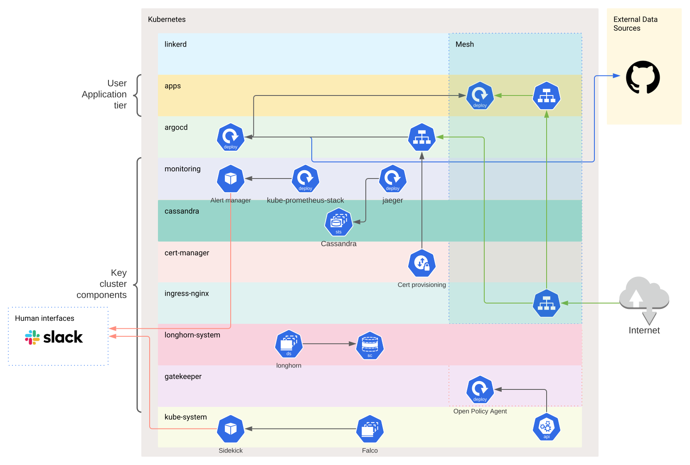
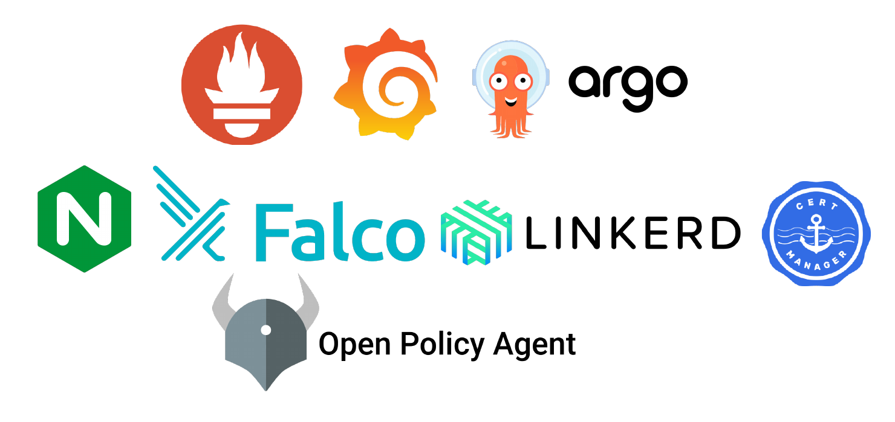
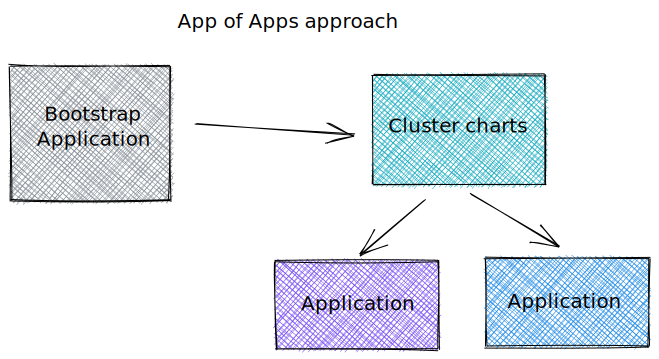
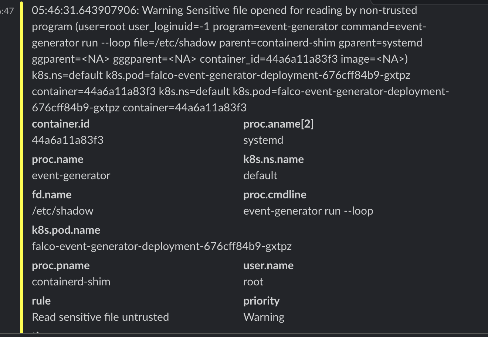
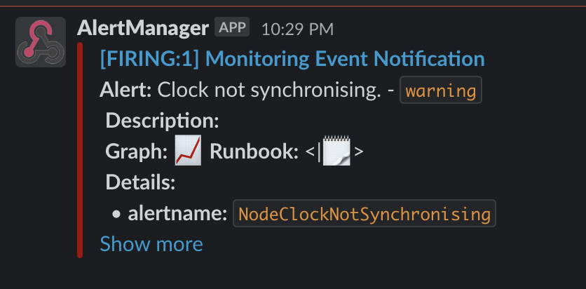

# kube-microcosm

A cluster that represents how a small start-up might be successful using a single Kubernetes cluster.

GitOps, Service-Mesh and observability techniques all out of the box.

_Up and running within 5 minutes..._



## Showcase

Showcasing the following projects within this cluster...



## Requirements 

- `step` 
- `helm` 
- `kubectl`


## Installation


1. Ensure an existing kubernetes cluster config is active
2. Run the following ( With your variables): 

```
SLACK_FALCO_WEBHOOK_URL="https://foo" \
SLACK_PROMETHEUS_WEBHOOK_URL="https://bar" \
SLACK_PROMETHEUS_CHANNEL=alerts DOMAIN=jonesax.dev \
make install
```

This will install the cluster level components and ready argocd to deploy user applications via the app-of-apps technique.

## User Applications

Users would be expected to operate within the ArgoCD control plane tier and utilise the App of Apps concept for bootstrapping with GitOps for day to day deployment.



A quick refresh on GitOps [here](https://www.weave.works/technologies/gitops/)


## Screenshots


Falco sidekick enables you to receive cluster security events in slack (and other integrations)...



Alert manager sending out notifications...




## Web accessibility

This installation uses cert-manager to provision certs for a domain.

It is up to you to alter the domains used in resources/ingress to one you own and point that alias to the IP the cluster load balancer is available on.

