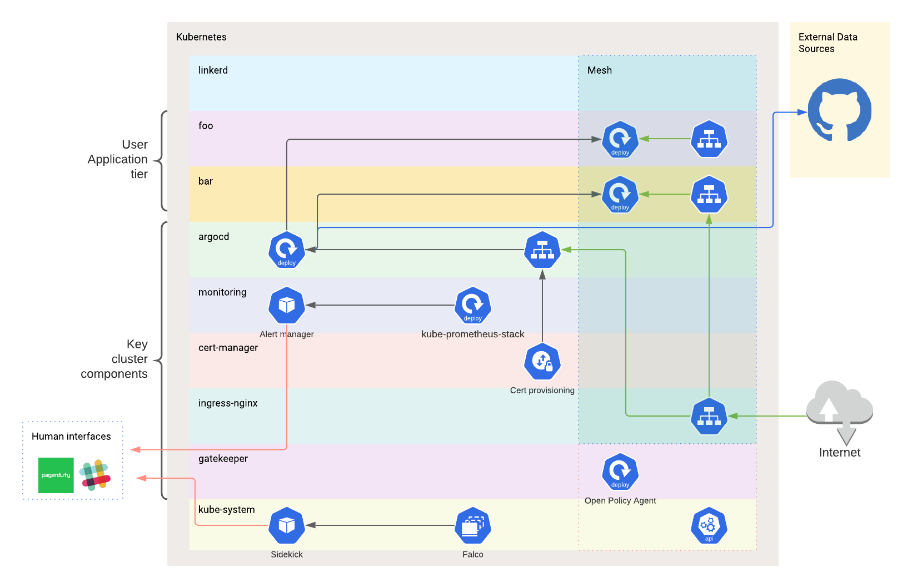
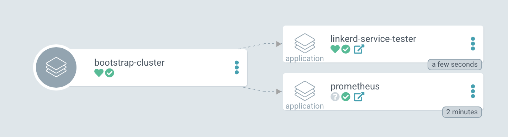
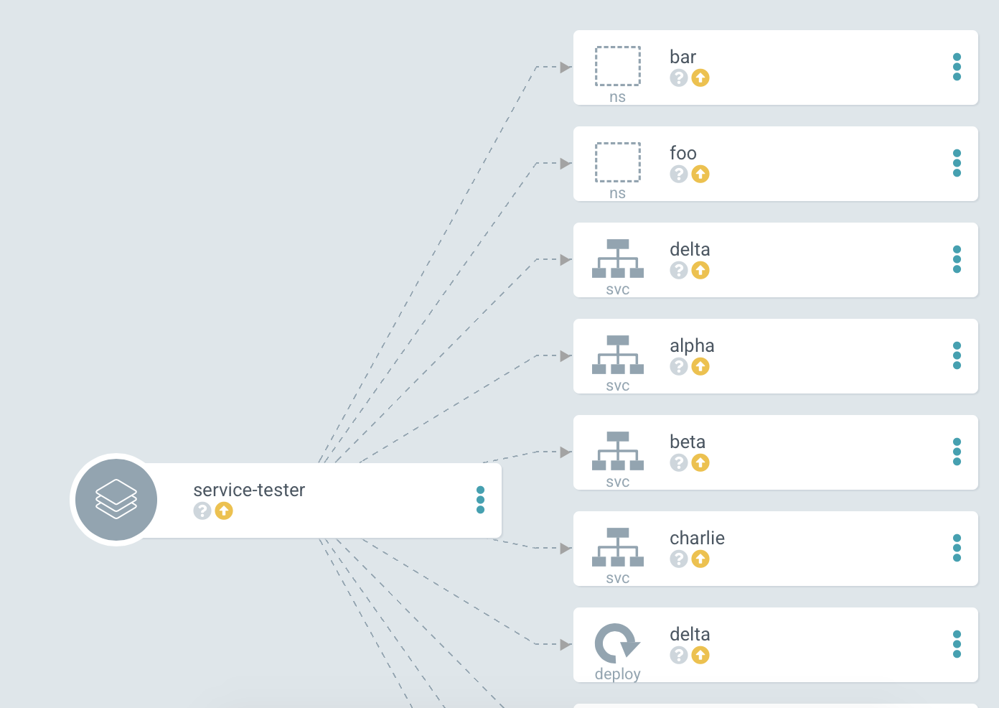
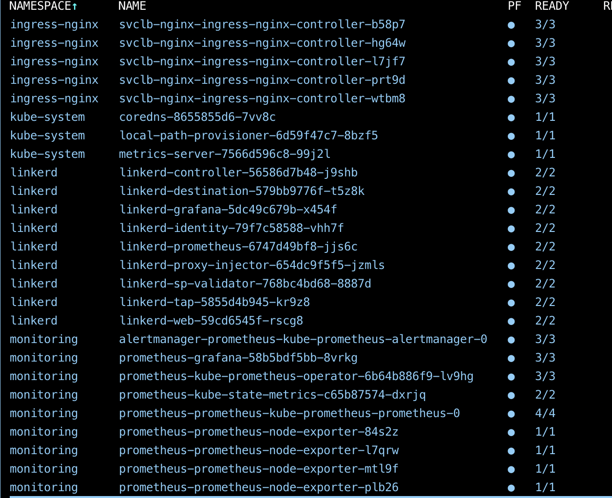

# kube-microcosm

A cluster that represents how a small start-up might be successful using a single Kubernetes cluster.
GitOps, Service-Mesh and observability techniques all out of the box.

## Installation

Have an existing kubernetes cluster config active and run `make install`

This will install the cluster level components and ready argocd to deploy user applications via the app-of-apps technique.

## Web accessibility

This installation uses cert-manager to provision certs for a domain.

It is up to you to alter the domains used in resources/ingress to one you own and point that alias to the IP the cluster load balancer is available on.

## Requirements 

- `step` for key generation for linkerd2
- helm 
- kubectl
