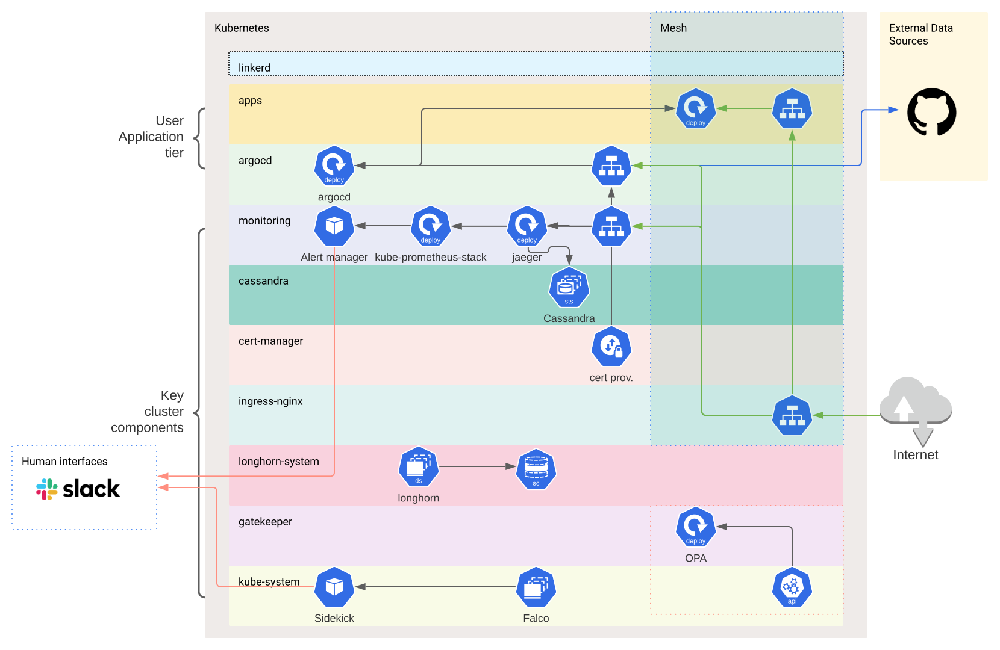

# kube-microcosm

A cluster that represents how a small start-up might be successful using a single Kubernetes cluster.

This is an opinionated illustration of a Kubernetes cluster and out-of-the-box applications.



## Showcase

Showcasing the following projects within this cluster...

```
NAME             	NAMESPACE      	REVISION	UPDATED                             	STATUS  	CHART                       	APP VERSION
argo             	argocd         	1       	2021-04-07 12:25:40.144062 +0100 BST	deployed	argo-cd-2.17.5              	1.8.4
cert-manager     	cert-manager   	1       	2021-04-07 12:22:57.96906 +0100 BST 	deployed	cert-manager-v1.0.2         	v1.0.2
falco            	kube-system    	1       	2021-04-07 13:45:35.358244 +0100 BST	deployed	falco-1.7.10                	0.27.0
gatekeeper       	default        	1       	2021-04-07 12:25:56.549697 +0100 BST	deployed	gatekeeper-3.3.0            	v3.3.0
jaeger           	monitoring     	1       	2021-04-07 12:22:01.505929 +0100 BST	deployed	jaeger-operator-2.19.1      	1.21.2
k8ssandra-cluster	cassandra      	1       	2021-04-07 12:22:23.006849 +0100 BST	deployed	k8ssandra-1.0.0
linkerd2         	default        	1       	2021-04-07 12:10:30.58336 +0100 BST 	deployed	linkerd2-2.10.0             	stable-2.10.0
longhorn         	longhorn-system	1       	2021-04-07 12:22:09.504869 +0100 BST	deployed	longhorn-1.1.0              	v1.1.0
nginx            	ingress-nginx  	1       	2021-04-07 12:23:04.762961 +0100 BST	deployed	ingress-nginx-3.3.0         	0.35.0
prom             	monitoring     	1       	2021-04-07 12:21:26.83435 +0100 BST 	deployed	kube-prometheus-stack-14.5.0	0.46.0
sidekick         	kube-system    	1       	2021-04-07 13:45:26.954836 +0100 BST	deployed	falcosidekick-0.2.9         	2.21.0
```


## Requirements

- `step`
- `helm`
- `kubectl`


## Installation


1. Ensure an existing Kubernetes cluster config is active. I like using [civo](https://www.civo.com).

```
civo kubernetes create interesting-times-gang -n3 --wait --remove-applications=traefik -s g3.k3s.large tycho --region NYC1
civo kubernetes config interesting-times-gang -s
```

2. Run the following ( With your variables):

```
// Example Slack webhook within a Slack App
SLACK_FALCO_WEBHOOK_URL="<YOUR SLACK WEBHOOK>" \
make install
```

or without...

```
make install
```
